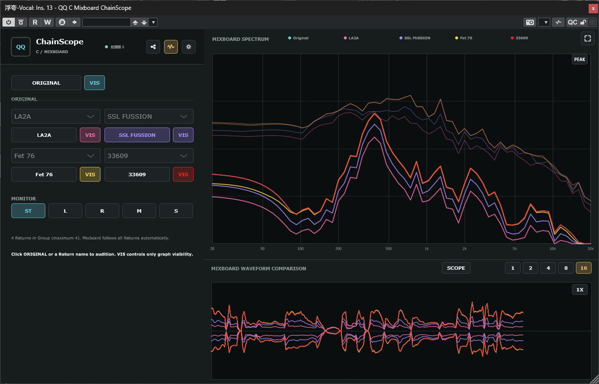
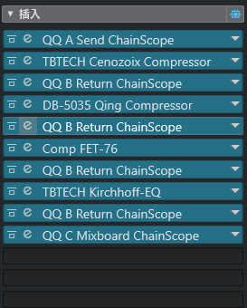
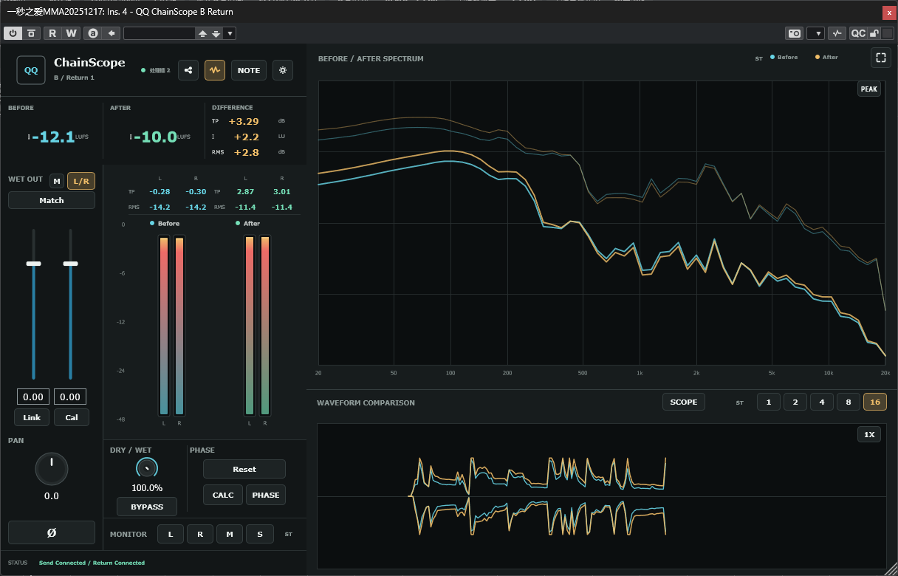
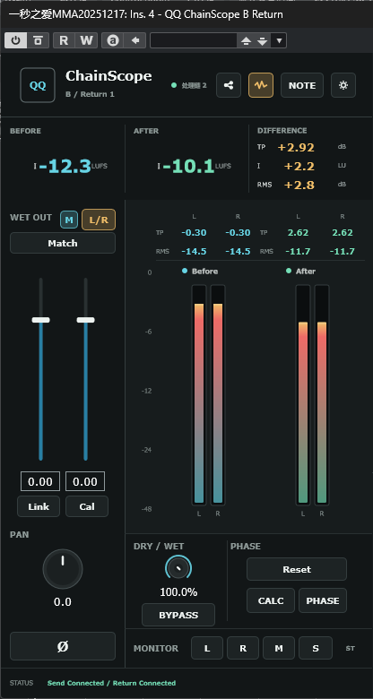
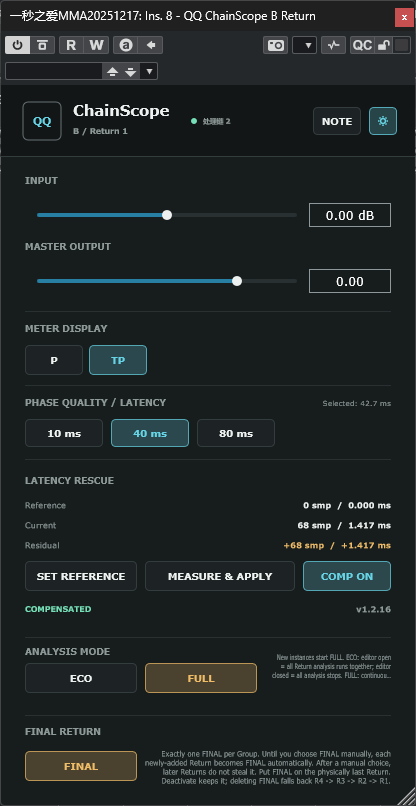
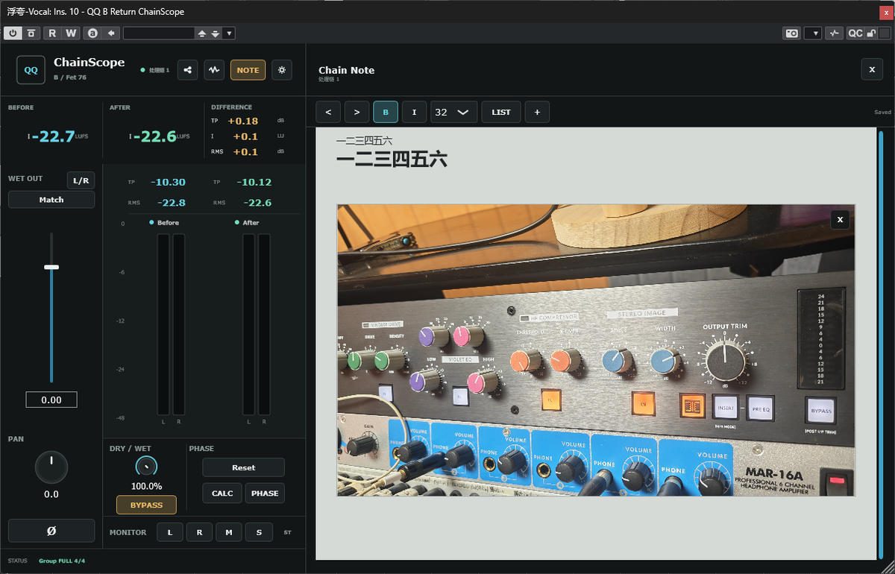
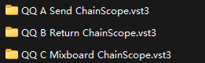
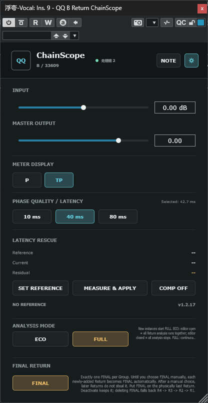

# 插件护士 - QQ ChainScope

**Qing Audio 官方下载与发布页 / Official downloads and releases by Qing Audio**

> **不是单纯的 A/B 按钮，也不是单纯的频谱仪。**  
> QQ ChainScope 是一套直接工作在真实 DAW 工程里的“处理链护士”：它帮助你检查处理前后变化、做公平响度比较、给整条链增加 Dry/Wet、校准相位与左右电平、修正残余延迟、记录硬件设置，并把最多四套处理方案放到同一个 Mixboard 里横向比较。
>
> **More than an A/B button or spectrum analyzer.**  
> QQ ChainScope is a practical “plug-in nurse” that lives inside a real DAW session: compare before/after behavior, loudness-match fairly, add Dry/Wet to a whole chain, align phase, calibrate L/R balance, rescue residual timing errors, document hardware settings, and compare up to four independent processing choices in one Mixboard.

> **QQ ChainScope 是专有软件，不开源。** 本公开仓库只提供编译后的插件成品、文档、截图和版本说明；源码仓库保持私有。  
> **QQ ChainScope is proprietary software and is not open source.** This public repository contains compiled plug-ins, documentation, screenshots, and release information only; the source repository remains private.

<p align="center">
  
</p>

## 最新版本 / Latest Release

**QQ ChainScope 1.2.17** 是当前最新、最稳定版本。  
**QQ ChainScope 1.2.17** is the current latest and most stable release.

- **[下载 v1.2.17 / Download v1.2.17](https://github.com/Ziqing-Gu/Plugin-Nurse-QQ-ChainScope-Release/releases/tag/v1.2.17)**
- **[全部版本 / All releases](https://github.com/Ziqing-Gu/Plugin-Nurse-QQ-ChainScope-Release/releases)**
- **[Issues / Bugs & Feedback](https://github.com/Ziqing-Gu/Plugin-Nurse-QQ-ChainScope-Release/issues)**

## 为什么做 QQ ChainScope？ / Why QQ ChainScope?

很多插件都能告诉你“它自己在做什么”，但真实混音里更常见的问题是：**整条处理链到底发生了什么？**

QQ ChainScope 的重点不是实验室式单插件测试，而是让你在真实工程里直接回答这些问题：

1. **处理前后到底改变了多少？** —— Peak、True Peak、播放段平均 RMS、Integrated LUFS、Spectrum、Waveform、WaveScope。
2. **我觉得这个版本更好，是因为更响吗？** —— 用 Match 把 After 的 Integrated LUFS 匹配到 Before。
3. **这个插件没有 Mix，或者我想把整条链并行混合怎么办？** —— ChainScope 给单个插件、插件串或外部硬件链增加时间对齐的 Dry/Wet。
4. **并行以后为什么发空、变薄、低频没了？** —— PHASE 用于 Original 与纯 Wet 之间的相位/时间关系校准。
5. **模拟硬件左右通道不完全一样怎么办？** —— L/R Cal 校准处理链额外引入的左右平均 RMS 失配；1.2.16 起可用 M 校准源建立更干净的双单声道测试条件。
6. **插件上报 latency 不准，PDC 后仍有残余错位怎么办？** —— Latency Rescue 对剩余误差做最后补救。
7. **硬件旋钮、接线、照片和说明总是散落在工程外？** —— Chain Note 把文字和图片直接跟工程一起保存。
8. **我有 LA-2A、33609、FET、SSL 等多个方案，怎么快速横向比较？** —— 一个 Group 最多 4 个 Return，Mixboard 从同一个 Original 出发快速试听和看图。

Many plug-ins can tell you what **they** are doing. In a real mix, the more useful question is often: **what happened across the whole processing chain?** QQ ChainScope is built around that workflow rather than isolated bench testing.

## 三个组件，一套工作流 / Three Components, One Workflow

从 1.2.17 开始，DAW 列表与 VST3 bundle 使用更短、更容易区分的名称：

| 插件 / Plug-in | 角色 / Role |
|---|---|
| **QQ A Send ChainScope** | 放在处理链之前，捕获 Original，并创建或选择 Group。 / Place before the chain to capture Original and create/select a Group. |
| **QQ B Return ChainScope** | 放在处理链之后，负责测量、Dry/Wet、QQ Bypass、PHASE、L/R Cal、Latency Rescue、图表和 Chain Note。 / Place after the chain for measurement, Dry/Wet, QQ Bypass, PHASE, L/R Cal, Latency Rescue, graphs, and Chain Note. |
| **QQ C Mixboard ChainScope** | 比较 Original 与最多四个 Return 结果；使用时必须放在 FINAL Return 之后。 / Compare Original with up to four Return results; when used, it must be placed after the FINAL Return. |

最简单的 Single Return：

```text
QQ A Send ChainScope -> plug-in / hardware chain -> QQ B Return ChainScope (FINAL)
```

Multi Return：

```text
Send -> Process A -> Return 1 -> Process B -> Return 2 -> Process C -> Return 3 -> Process D -> Return 4 (FINAL) -> Mixboard
```

**重要：Multi Return 不是把 A+B+C+D 的效果累积起来。** 每个非 FINAL Return 会先记录自己这一套处理结果，然后把时间对齐后的 Original 继续交给下一套处理，所以 R1-R4 都是从同一个 Original 出发的独立方案。

**Important:** Multi Return does **not** compare cumulative A+B+C+D processing. Each non-FINAL Return captures its own result and then passes the aligned Original onward, so R1-R4 remain independent choices based on the same source.

<p align="center">
  
</p>

同一个 Group 应放在**同一 Track 的串行 Insert 链**上。一个 Group 支持 1 个 Send、1-4 个 Return，以及 1 个可选 Mixboard。真正物理位置最后的 Return 必须是 **FINAL**；Mixboard 必须放在 FINAL 后面。

Keep one Group on one serial Insert chain in the same Track. A Group supports one Send, one to four Returns, and an optional Mixboard. The physically last participating Return must be **FINAL**, and Mixboard must be placed after FINAL.

## Return：处理前后到底发生了什么？ / Return: What Changed?

<p align="center">
  
</p>

Return 同时提供：

- **Before / After / Difference**：Integrated LUFS 与差值总览。
- **Peak / True Peak**。
- **播放段平均 RMS**：从当前一次 Play 开始累计，到 Stop 停止并保持；下一次 Play 重新开始。
- **Spectrum**：Before / After，Peak / AVG，悬停查看 Delta。
- **Waveform / WaveScope**：1 / 2 / 4 / 8 / 16 拍刷新，并与工程时间对齐。
- **Match**：一次性把 After Integrated LUFS 匹配到 Before，减少“更响所以更好”的误判。
- **Dry / Wet**：对整条处理链做并行混合。
- **QQ Bypass**：在处理结果和时间对齐后的 Original 之间切换；不是 DAW 的 Deactivate。
- **Monitor**：ST / L / R / M / S。

## L/R Cal 与 M 校准源 / L/R Cal and the M Calibration Source

模拟硬件或某些处理链左右通道可能存在固定电平偏差。L/R Cal 的目标不是强制让左右一样大，而是只修正**处理链额外引入的左右平均 RMS 失配**，保留原始 Stereo 本身的左右关系。

普通 Stereo 素材的左右频谱并不相同，因此即使一个完全对称的 EQ 对 L/R 做同样处理，也可能让左右 RMS 产生不同变化。为了让硬件 L/R 校准更准确，1.2.16 起在 **L/R 模式**中加入了小型 **M** 校准源：

- M ON 时，Send 在处理链之前生成 `Mid = (L + R) / 2`，再复制为双单声道 `L = Mid, R = Mid`。
- Before 的 Meter、TP、RMS、LUFS、Spectrum、Waveform、WaveScope 都以这个双单声道 Mid 为参考。
- After 仍然是处理链真实的 L/R 输出。
- 成功 Cal 后，M 会自动关闭并恢复正常 Stereo。
- M 是**校准工具**，不是 Monitor 区域里的 Mid 监听按钮。

<p align="center">
  
</p>

## PHASE：先校准纯 Wet，再决定 Dry/Wet / PHASE: Calibrate Pure Wet First

PHASE CALC 基于 **Original / Dry 与纯 Wet** 的关系进行测量，发生在 Dry/Wet 混合之前。因此 Dry/Wet 设为 100%、50% 或 20% 都不会改变 PHASE CALC 的测量逻辑。

推荐流程：

```text
播放素材 -> Stop -> CALC -> PHASE ON/OFF A/B
```

点击 CALC 后，当前播放段的 Meter / LUFS / RMS 显示会被清空，这是正常行为；模型已经计算完成，新一次播放会重新开始分析。

PHASE CALC is based on the relationship between the aligned Original/Dry and the **pure raw Wet** before Dry/Wet mixing. The Dry/Wet knob therefore does not change the calibration measurement.

## Latency Rescue：PDC 后还剩多少“旧账”？ / Residual Timing Rescue After PDC

**PDC = Plugin Delay Compensation.** 插件会把处理延迟告诉 DAW，DAW 再做自动补偿。Latency Rescue 不替代 PDC；它处理的是 **PDC / 外部 FX 延迟补偿已经工作之后，仍然残留的时间误差**。

最简单的操作方法：

```text
完全 Deactivate 待测插件 + 它后面的插件
-> 播放同一段素材 -> Stop -> SET REFERENCE
-> 重新打开这些插件
-> 再播放同一段 -> Stop -> MEASURE & APPLY
-> COMP ON
```

三个数值的意义：

- **Reference**：建立基准时，Send→Return 保留下来的残余延迟。**通常应该是 0。** 如果不是 0，说明当前待校准插件之前的链路已经有未完全补偿的“旧残余误差”。它不是正常插件总 latency。
- **Current**：打开当前待校准插件以后，整段 Send→Return 现在的残余误差。
- **Residual = Current - Reference**：当前待校准对象新增加的残余误差，也是 Latency Rescue 真正需要修正的数值。

<p align="center">
  
</p>

## Mixboard：同一个 Original，最多四套独立方案 / One Original, Up to Four Choices

Mixboard 用于真正的横向比较，而不是把四条曲线简单堆在一起：

- 点击 **ORIGINAL**：试听未经当前 Return 方案处理的 Original。
- 点击某个 Return 名称：试听那一套独立处理结果。
- 一次只听一套结果；切换使用短平滑过渡。
- **VIS = Visibility**：只控制曲线显示/隐藏，不改变声音。
- Spectrum / Waveform / WaveScope 与统一对齐后的 Original + R1-R4 数据源一致。
- Monitor 提供 ST / L / R / M / S，直接改变 Mixboard 最终监听输出。

<p align="center">
  
</p>

## Chain Note：把硬件和处理链资料留在工程里 / Keep the Chain Documentation Inside the Session

Chain Note 支持文字、中文/Unicode、图片、硬件照片、接线说明与参数记录，并随 DAW 工程保存。适合记录：

- 模拟硬件旋钮位置；
- Patch / External FX 接线；
- 插件参数与处理思路；
- 需要以后复现的特殊处理链；
- A/B 结论与工程备注。

<p align="center">
  
</p>

## FULL / ECO 与性能 / Analysis Performance

FULL / ECO **只决定显示分析什么时候工作，不改变声音 DSP**。

- **Return FULL**：只要 DAW 实时工作，显示分析持续运行；界面关闭只是停止绘制，不等于改变声音。
- **Return ECO**：Return 编辑器打开时，Meter / LUFS / Difference / Spectrum / Waveform / WaveScope 作为一个完整分析 Session 工作；编辑器关闭后停止显示分析。
- **Mixboard FULL**：实时持续维护 Mixboard 分析。
- **Mixboard ECO**：只有 Mixboard 编辑器可见并且 Graph 展开时才做图表分析。
- **Offline Render**：无论 FULL 还是 ECO，显示分析都自动关闭；声音 DSP 正常工作。
- **Transport Stop Hold**：Stop 后 Spectrum / Waveform / WaveScope 保持最后一帧，不再被宿主停止状态下的静音 callback 冲掉；播放段 RMS/LUFS 也停止累计。

## 1.2.17 更新 / What Changed in 1.2.17

1.2.17 是一个**DAW 可读性更新**：三个 VST3 的 DAW 显示名与实际 bundle 名都改为更容易在窄插件列表里区分的 A/B/C 前缀：

```text
QQ A Send ChainScope.vst3
QQ B Return ChainScope.vst3
QQ C Mixboard ChainScope.vst3
```

插件角色、DSP、Group/Runtime、参数、工程状态以及现有功能保持不变。

**升级注意：** 旧版文件名不会自动消失。升级到 1.2.17 时应先删除：

```text
QQ ChainScope Send.vst3
QQ ChainScope Return.vst3
QQ ChainScope Mixboard.vst3
```

再放入新版三个 bundle，避免 DAW 同时扫描到新旧两套文件。

<p align="center">
  
</p>

### 近期 1.2.x 重要更新 / Recent 1.2.x Highlights

- **1.2.16 — Mid Calibration Source**：L/R 模式新增 M 双单声道校准源；成功 Cal 后自动恢复 Stereo。
- **1.2.15 — Transport Stop Hold**：在 REAPER 等宿主 Stop 后仍继续 callback 的情况下，图表保持最后一帧，播放段统计停止累计。
- **1.2.14 — UTF-8 Safe Runtime Names**：Group / Return 名称支持更可靠的中文、日文、韩文等多字节字符。
- **1.2.13 — Auto Final Until Manual**：新 Return 自动成为 FINAL，第一次手动选择 FINAL 后进入手动锁定。
- **1.2.12 — Manual FINAL Return**：Multi Return 的唯一 FINAL 规则与统一输出。
- **1.2.7 — Shared Aligned Spectrum**：Return 与 Mixboard 共用统一对齐后的分析源。
- **1.2.6 — Unified Aligned Sources**：Original + R1-R4 统一到同一时间轴后再决定播放与分析哪一路。

## 下载 / Downloads

v1.2.17 Release 提供：

- **QQ-ChainScope-1.2.17-Windows-x64-VST3.zip**
- **QQ-ChainScope-1.2.17-macOS-Apple-Silicon-VST3.zip**
- **QQ-ChainScope-1.2.17-macOS-Intel-VST3.zip**
- **QQ-ChainScope-1.2.17-macOS-Universal-2-AU.zip**
- **QQ-ChainScope-1.2.17-Installation-Guide-Chinese.txt**
- **QQ-ChainScope-1.2.17-Installation-Guide-English.txt**
- **QQ-ChainScope-User-Manual-Chinese-v1.2.17.pdf**
- **QQ-ChainScope-User-Manual-English-v1.2.17.pdf**
- **QQ-ChainScope-1.2.17-SHA256SUMS.txt**

A Send、B Return 和 C Mixboard 必须保持同一版本并一起更新。  
A Send, B Return, and C Mixboard must remain on the same version and be updated together.

## 安装 / Install

### Windows x64 VST3

1. 完全退出 DAW。
2. 如果从 1.2.16 或更早版本升级，先删除旧 bundle 名。
3. 解压 Windows 包。
4. 将三个新版 `.vst3` bundle 放到：

```text
C:\Program Files\Common Files\VST3
```

5. 重新打开 DAW，必要时重新扫描插件。

### macOS VST3

- Apple Silicon 原生宿主：安装 Apple Silicon VST3 包。
- Intel Mac 或 Rosetta 下的 Intel 宿主：安装 Intel VST3 包。
- **不要同时安装两套 VST3 架构包。**

用户目录 / Per-user folder:

```text
~/Library/Audio/Plug-Ins/VST3
```

### macOS Audio Unit

Universal 2 AU 包包含 arm64 + x86_64：

```text
~/Library/Audio/Plug-Ins/Components
```

macOS 构建经过临时签名与构建验证，但**没有 Apple Developer ID 公证**。如果系统阻止加载，请只在确认文件来自本仓库 Release 后，按照随包安装说明处理 quarantine 属性。

The macOS builds are ad-hoc signed and build-validated, but **not notarized with an Apple Developer ID**. If macOS blocks them, follow the included installation guide only after confirming the files came from this repository's Release.

## 系统要求 / Requirements

| 平台 / Platform | 格式与架构 / Format and Architecture |
|---|---|
| Windows | 64-bit VST3 / x64 |
| macOS Apple Silicon | VST3 / native arm64 |
| macOS Intel | VST3 / native x86_64 |
| macOS AU | Universal 2 / arm64 + x86_64 |
| macOS 最低目标系统 / Deployment target | macOS 11 or later |

## 用户手册 / User Manuals

v1.2.17 的新版截图增强手册包含真实 DAW / 插件截图，覆盖：Quick Start、Send、Return、L/R + M、PHASE、Latency Rescue、Spectrum、Waveform / WaveScope、Chain Note、FULL/ECO、FINAL、Multi Return、Mixboard、安装与故障排查。

- 中文版：33 页
- English: 34 pages

完整细节以 Release 中的对应 PDF 为准。  
For complete operating details, use the matching PDF manual in the v1.2.17 Release.

## FINAL 规则 / FINAL Rules

- 同一个 Group 正常情况下只有一个 FINAL。
- 物理位置最后的参与 Return 必须是 FINAL。
- Mixboard 必须放在 FINAL 后面。
- R1-R4 是稳定身份/颜色，不代表物理 Insert 顺序。
- 新建 R2/R3/R4 时，系统在自动阶段让最新 Return 成为 FINAL；第一次手动点 FINAL 后进入 Manual Final Lock。
- Deactivate FINAL 不会转移身份；真正删除该 Return 才触发 fallback。

<p align="center">
  
</p>

## 问题与反馈 / Bugs & Feedback

请使用本仓库的 **[Issues](https://github.com/Ziqing-Gu/Plugin-Nurse-QQ-ChainScope-Release/issues)** 提交可复现问题，并尽量附上：

- 操作系统与版本；
- DAW 与版本；
- VST3 / AU；
- x64 / arm64；
- ChainScope 版本；
- Single Return / Multi Return；
- 实际 Insert 顺序；
- 复现步骤；
- 截图、录屏或工程片段（如果方便）。

For reproducible bug reports, include OS, DAW/version, plug-in format/architecture, ChainScope version, Single/Multi Return topology, actual insert order, reproduction steps, and screenshots/video when possible.

## 许可与使用 / License & Usage

QQ ChainScope 为 Qing Audio 的专有软件，不开源。公开下载仅包含编译后的插件成品与文档，不包含源码。  
QQ ChainScope is proprietary Qing Audio software and is not open source. Public downloads contain compiled plug-ins and documentation only, with no source code.

---

**Qing Audio · QQ ChainScope · “插件护士 / Plug-in Nurse”**
